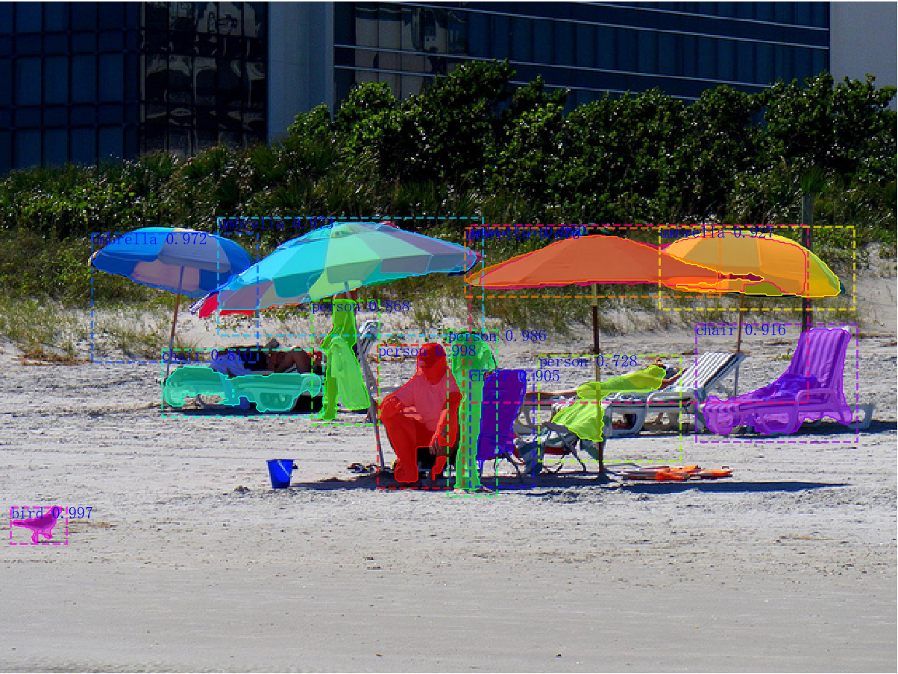

# Keras-PANet
PANet for Instance Segmentation and Object Detection 

This is an implementation of [PANet](https://arxiv.org/abs/1803.01534) on Python 3, Keras, and TensorFlow. The model generates bounding boxes and segmentation masks for each instance of an object in the image. It's based on Feature Pyramid Network (FPN) and a ResNet backbone.



# Training on MS COCO
In this repository, i train the code with BN layers in the backbone fixed and use GN in other part. Training and evaluation code is in `samples/coco/coco.py`. You can run it directly from the command line as such:
```
# Train a new model starting from ImageNet weights
python3 samples/coco/coco.py train --dataset=/path/to/coco/ --model=/path/pretrained_models/resnet50.h5  --download=True

# Continue training the last model you trained. This will find
# the last trained weights in the model directory.
python3 samples/coco/coco.py train --dataset=/path/to/coco/ --model=last
```
You can also run the COCO evaluation code with:
```
# Run COCO evaluation on the last trained model
python3 samples/coco/coco.py evaluate --dataset=/path/to/coco/ --model=last
```
The training schedule, learning rate, and other parameters should be set in `samples/coco/coco.py`.

# Reference
Original implementation[https://github.com/ShuLiu1993/PANet]

Mask RCNN[https://github.com/matterport/Mask_RCNN]
